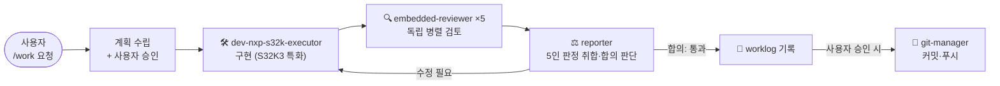

# 🔩 claude-nxp-s32k3-agents

> **NXP S32K3 / 임베디드 MCU 개발을 위한 Claude Code 멀티 에이전트 팩**
> 계획 → 승인 → 구현 → 5인 독립 검토 → 합의 → 기록. 펌웨어 코드는 "대충 넘어가면" 현장에서 터집니다. 이 팩은 그걸 구조적으로 막습니다.


---

## ✨ 왜 만들었나

임베디드 코드는 데스크톱 코드와 다르게 실패합니다. ISR 안의 `printf` 한 줄, `volatile` 빠진 공유 변수 하나가
**재현 불가능한 필드 불량**이 됩니다. 그리고 S32 Config Tools 는 `.mex` 편집 순서 하나만 틀려도
편집 내용을 통째로 날려버립니다.

이 팩은 실제 S32K3 양산 프로젝트에서 **직접 겪으며 축적한 함정들**을 에이전트 지식으로 고정하고,
LLM 특유의 "그럴듯한 추측"을 **5인 독립 검토 + 합의 프로토콜**로 걸러냅니다.

## 🧠 에이전트 파이프라인



| 에이전트 | 역할 | 권한 |
|---|---|---|
| [`dev-nxp-s32k-executor`](.claude/agents/dev-nxp-s32k-executor.md) | S32K3 구현 전담. `.mex` 편집 절차, RTD 6.0.0 네이밍, LPI2C 클럭 함정 등 실전 지식 내장 | 읽기/쓰기 |
| [`dev-executor`](.claude/agents/dev-executor.md) | 범용 구현 (STM32 등 비-S32K3 코드) | 읽기/쓰기 |
| [`embedded-reviewer`](.claude/agents/embedded-reviewer.md) | ISR 안전성·volatile·타이밍·리소스 검토. **5인 독립 병렬** 실행 | **읽기 전용** |
| [`reporter`](.claude/agents/reporter.md) | 5인 판정 취합 + 합의 판단, 종합 보고서 작성 | 보고서만 쓰기 |
| [`git-manager`](.claude/agents/git-manager.md) | 사용자 명시 승인 후에만 커밋·푸시. `--force` 원천 금지 | 코드 수정 불가 |

### 🗳 5인 검토 합의 프로토콜 — 다수결이 아니다

동일한 지시·동일한 파일로 **5개의 리뷰어 인스턴스를 병렬 실행**하고, 취합 에이전트가 판정합니다.

- 5인 전원 `통과` → 통과
- **1인이라도 근거 있는 `심각` 지적** → 수정. 다수결이 아니라 *근거의 타당성*으로 판단
- 근거 없는 지적은 `근거 부족` 으로 필터링 — 조작된 지적이 수정 루프를 오염시키지 않게
- 리뷰어끼리는 서로의 결과를 절대 모름 — 독립성이 합의의 전제

## 🎯 이 팩만의 도메인 지식 (하이라이트)

`dev-nxp-s32k-executor` 에 박아 넣은, 문서에는 잘 없는 실전 규칙들:

- **`.mex` 편집 4단계 절차** — Config Tools 가 열려 있으면 Update Code 가 메모리 상태로 `.mex` 를 덮어써서 편집이 통째로 증발
- **`quick_selection` 속성 제거** — 안 지우면 파일 로드 때마다 프리셋이 편집을 되돌림
- **`SpiDataShiftEdge` 의 반직관 매핑** (`LEADING → CPHA=1`)
- **LPI2C 만 클럭 레퍼런스 포인트 경로 필요** — 빠지면 Update Code 자체가 막힘
- **신호명·채널 번호는 `.epd` / RTD 예제에서 확인, 추측 금지** — 추측값은 Config Tools 가 조용히 무시함
- **회로도 PDF 는 고배율 영역 렌더링으로 읽기** — 텍스트 좌표만으로는 핀↔넷 매칭 불가

## 🔌 MCP 구성 ([.mcp.json](.mcp.json))

| 서버 | 용도 |
|---|---|
| **Context7** | FreeRTOS / RTD / HAL 등 라이브러리 최신 문서를 근거로 인용 — "추측 금지" 원칙의 실탄 |
| **GitHub** | 이슈·PR 조회, 코드 검색 (원격 공식 서버) |
| **Memory** | 세션을 넘는 설계 결정·핀맵 지식 그래프 유지 |

> 데이터시트 검색용 사내 MCP 서버가 있다면 `mcpServers` 에 추가하는 것만으로 리뷰어들의 근거 검증에 바로 활용됩니다.

## 🚀 설치

```bash
# 1. 프로젝트 루트에 압축 해제 (.claude/ 와 .mcp.json 이 루트에 오도록)
# 2. CLAUDE.md.example 을 CLAUDE.md 로 복사 후 프로젝트에 맞게 수정
# 3. Claude Code 실행 후:
/work LPUART3 수신 버퍼 오버플로 수정해줘
```

## 📁 구조

```
claude-nxp-s32k3-agents/
├── .claude/
│   ├── agents/
│   │   ├── dev-nxp-s32k-executor.md   # S32K3 구현 (실전 함정 지식 내장)
│   │   ├── dev-executor.md            # 범용 구현
│   │   ├── embedded-reviewer.md       # 읽기 전용 검토 ×5
│   │   ├── reporter.md                # 취합·합의 판단 + 보고서
│   │   └── git-manager.md             # 승인 기반 형상관리
│   └── skills/
│       └── work/SKILL.md              # /work 파이프라인 오케스트레이터
├── .mcp.json                          # Context7 · GitHub · Memory
├── CLAUDE.md.example                  # 프로젝트 규칙 템플릿
└── README.md
```

## 🧭 설계 원칙

1. **쓰는 두뇌와 검사하는 두뇌를 분리한다** — 리뷰어는 `Edit`/`Write` 권한 자체가 없음
2. **막히면 추측하지 않고 즉시 멈춘다** — 근거 없는 통신 파라미터는 곧 필드 불량
3. **생성 코드는 신성불가침** — `generate/`·`board/` 수동 편집 금지, 변경은 `.mex` 경유
4. **git 은 사람이 승인한다** — 검토 통과 ≠ 푸시 허가

## 📄 License

MIT
